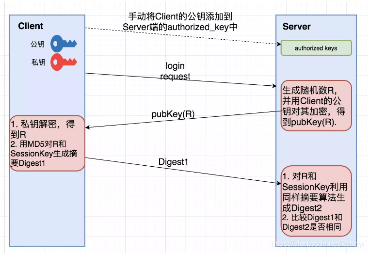
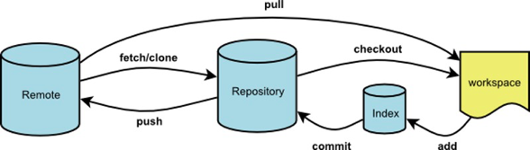
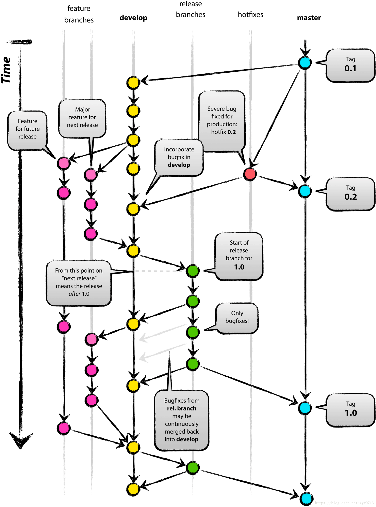

# [SSH](https://www.thisfaner.com/p/ssh-key-git-usage/)

1. SSH 是网络协议,用于服务器和客户端之间的连接

2. 工作流程（客户端安全验证）：

   1. 客户端生成 私钥 && 公钥
   2. 服务器注册公钥
   3. 客户端发送请求，服务器端比对请求附带的公钥，若一致，通过公钥加密质询,发送回客户端
   4. 客户端收到质询，通过私钥解密数据，比对开放通道

   

3. 关于 ssh 的配置

   1. 位置：~/.ssh 下的 config 
   2. Host: （一个 nickname） == User@Hostname 所以所有配置完了之后如果要建立连接，ssh [Host] 

4. 关于known_host 的作用：

   验证是否是可信的服务端，而不是冒充的劫持者 [link](https://security.stackexchange.com/questions/20706/what-is-the-difference-between-authorized-keys-and-known-hosts-file-for-ssh)

   怎么管理：[link](https://serverfault.com/questions/29262/how-to-manage-my-ssh-known-hosts-file) 其中 hostname 的格式： [ip address]:port  

   有个问题：为什么在在known_host 中有些有 hostname ，有些只有 ip?

   ​	
   
   # Git 流程
   
   
   
   ​	[注:] index 是缓存区，指未向仓库提交的部分
   
   
   
   在开发中，git flow 往往遵循以下方式：[link](https://www.cnblogs.com/jeffery-zou/p/10280167.html)
   
   
   
   1. **用于记录历史的分支**
   
      Gitflow 使用**两个**分支来记录项目开发的历史 
   
      - master分支: 保存官方的发布历史,方便打tag
      - develop分支才是用于集成各种功能开发的分支
   
   2. **用于功能开发的分支**
   
      在创建新的功能开发分支时，父分支应该选择develop
   
   3. **用于发布的分支**
   
      在这个分支上只能修复bug，做一些文档工作或者跟发布相关的任务,不会再增加新的功能
   
   4. **用于维护的分支**
   
      唯一一种可以直接基于master创建的分支。一旦问题被修复了，所做的改动应该被合并入master和develop分支
